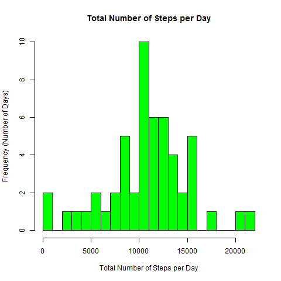
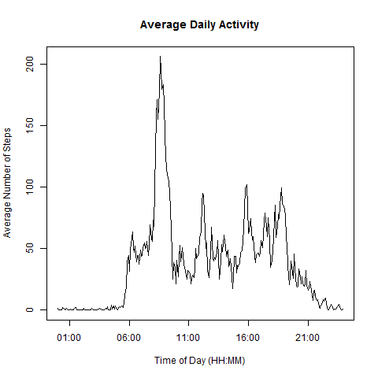
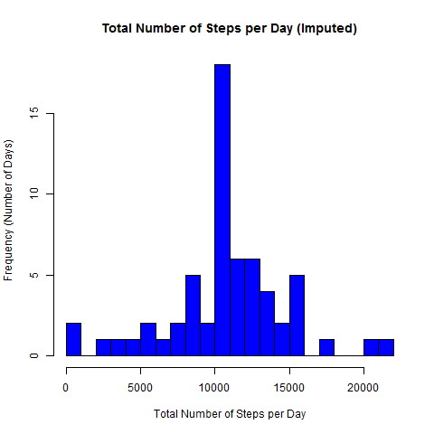
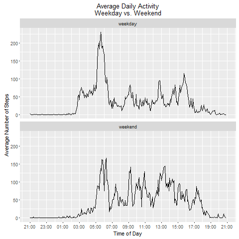

```{r setup, include=FALSE}
knitr::opts_chunk$set(echo = TRUE)
```

# Loading and preprocessing the data

Reading the data into activity data frame and show some summary statistics

```{r savefile}
setwd("/Users/skoutavidi001/Documents/coursera/Reproducible1")
dataset <- read.csv("activity.csv", header = TRUE, sep = ',' ,colClasses = c(date = "Date"))
str(dataset)
summary(dataset)
```
# Loading libraries 

```{r savefile1}
 library(dplyr)
 library(knitr)
```
# What is mean total number of steps taken per day?
```{r savefile2}
  total_steps_per_day <- dataset %>%
            group_by(date) %>%
            summarize(total.steps = sum(steps, na.rm = FALSE))
head(total_steps_per_day)
```
# Histogram to show what is mean total number of steps taken per day?

Missing values are excluded from the calculation

```{r hist1, echo=FALSE}
hist(total_steps_per_day$total.steps, 
         main = "Total Number of Steps per Day", 
           xlab = "Total Number of Steps per Day", 
           ylab = "Frequency (Number of Days)", 
           breaks=20,   col = "green")


```
 


The mean total number of steps taken per day is calculated as follows:

```{r mean1}
mean(total_steps_per_day$total.steps, na.rm=TRUE)
```
The median of steps taken per day is calculated as follows:

```{r median1}
median(total_steps_per_day$total.steps, na.rm=TRUE)
```

# What is the average daily activity pattern?

```{r avg_steps}
avg_steps <- dataset %>%
            group_by(interval) %>%
           summarize(avg.steps = mean(steps, na.rm = TRUE))
head(avg_steps)
```
# Below plot is showing the average daily activity pattern

```{r plot1, echo=FALSE}
plot(strptime(sprintf("%04d", avg_steps$interval), format="%H%M"),
        avg_steps$avg.steps, type = "l", 
         main = "Average Daily Activity", 
         xlab = "Time of Day (HH:MM)", 
          ylab = "Average Number of Steps")
```
 

# Which 5-minute interval, on average across all the days in the dataset, contains the maximum number of steps?

```{r filter}
filter(avg_steps, avg.steps==max(avg.steps))
```
# Calculate missing values
```{r missing}
sum(is.na(dataset))
```
# Imputing missing values

The missing values can be filled with the mean number of steps for the given interval. The mean number of steps per interval has already been calculated, it is the dataframe `avg_steps`.

```{r imputing}
Imputing_missing <- inner_join(dataset, 
                                                              avg_steps, 
                                                             by="interval") %>% 
            mutate(steps=ifelse(is.na(steps),avg.steps,steps)) %>%
           select(date,interval,steps)
head(Imputing_missing)
```
# Creating an histogram upon replacing missing values 

```{r imputing_total_steps}
total_steps_imputed <- Imputing_missing %>%
         group_by(date) %>%
            summarize(total.steps = sum(steps,na.rm=FALSE))

hist(total_steps_imputed$total.steps, 
         main = "Total Number of Steps per Day", 
           xlab = "Total Number of Steps per Day", 
          ylab = "Frequency (Number of Days)", 
          breaks=20,   col = "green")
```

 

Mean has not changed (as expected)
```{r mean2}
mean(total_steps_imputed $total.steps)
```
Median on the other hand is now equal to mean 
```{r median2}
median(total_steps_imputed $total.steps)
```
# A column is  added to set weekday and weekend

```{r weekday}
Final_Dataset <- mutate(Imputing_missing, weektype = ifelse(weekdays(as.Date(Imputing_missing$date)) == "Σάββατο" | weekdays(as.Date(Imputing_missing$date)) == "Κυριακή", "weekend", "weekday"))


activity.pattern <- Final_Dataset %>%
            group_by(weektype,interval) %>%
             summarize(avg.steps=mean(steps))
```
# Finally Averagae Daily Activity is compared for Weekday and Weekend

`ggplot` is being used for this comparison chart 

```{r ggplot}
library(ggplot2)
library(scales)
ggplot(activity.pattern, aes(strptime(sprintf("%04d", interval), format="%H%M"),
                                                         avg.steps)) +
            geom_line() +
            facet_wrap(~ weektype, ncol=1) +
             xlab("Time of Day") +
             scale_x_datetime(labels = date_format("%H:%M"), 
                                                    breaks = date_breaks("2 hour")) +
            scale_y_continuous("Average Number of Steps") +
             theme(plot.title = element_text(vjust=2)) +
             ggtitle("Average Daily Activity\nWeekday vs. Weekend")
 

```


 

